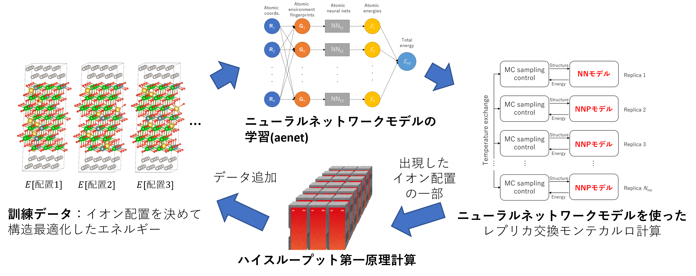

.. pyMC documentation master file, created by
   sphinx-quickstart on Wed Jul 31 13:13:22 2019.
   You can adapt this file completely to your liking, but it should at least
   contain the root `toctree` directive.

概要
------------------------------------------
abICSは、多成分系における結晶格子上の原子配置の統計熱力学計算を行うためのパッケージです。合金系や複合酸化物系に
おいて、温度依存の規則・不規則相転移や、短・中距離秩序の変化を定量的に予測し、それを加味した物性予測を可能にすることを
目的としています。
abICSは元々、第一原理計算とレプリカ交換モンテカルロ法を直接組み合わせて上述したような計算を行うことを念頭に開発されましたが、
計算できるモデル規模やステップ数が、第一原理計算の大きな計算コストのために限られてしまいます。
これに対して、Ver. 2では、構造最適化後のエネルギーを高速に予測するニューラルネットワークモデルを構成するための能動学習手法を実装し、
飛躍的にサンプリング速度を向上させました `[論文プレプリント] <https://arxiv.org/abs/2008.02572>`_ 。
このチュートリアルでは、この手法によるMgAl2O4スピネル結晶のMg/Alサイト反転度の計算方法を解説します。
```examples/standard/active_learning ``` にあるサンプルを用います。

abICSに実装されている能動学習手法の大まかな流れは以下の通りです。

1. ランダムに生成した多数の原子配置に対して第一原理計算を行い、学習データ（原子配置とエネルギーの対応関係）を用意する
2. 用意した学習データを使って、原子配置からエネルギーを予測するニューラルネットワークモデルを構築する
3. ニューラルネットワークモデルを使って、レプリカ交換モンテカルロ法による原子配置の統計熱力学サンプリングを行う
4. モンテカルロ計算で出現したイオン配置をサンプリングし、第一原理計算を行うことで、ニューラルネットワークモデルの精度の評価を行う
5. 不十分であった場合は、4.で計算した結果を学習データに追加し、2.から繰り返す。

:ref:`sec_basic_usage` で、個々のステップにおけるabICSの利用手順について説明します。




