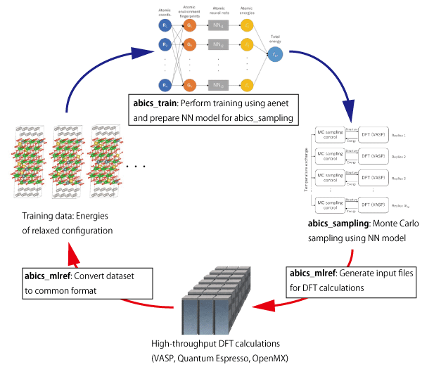

.. _sec_basic_usage:

***************************
基本的な使用方法
***************************

.. highlight:: none

能動学習について
------------------------------------------
abICSは元々、第一原理計算とレプリカ交換モンテカルロ法を直接組み合わせて統計熱力学計算を行うことを念頭に開発されましたが、
計算できるモデル規模やステップ数が、第一原理計算の大きな計算コストのために限られてしまいます。
これに対して、Ver. 2では、構造最適化後のエネルギーを高速に予測する機械学習モデルを構成するための能動学習手法を実装し、
飛躍的にサンプリング速度を向上させました `[論文プレプリント] <https://arxiv.org/abs/2008.02572>`_ 。

abICSに実装されている能動学習手法の大まかな流れは以下の通りです。

1. ランダムに生成した多数の原子配置に対して第一原理計算を行い、訓練データ（原子配置とエネルギーの対応関係）を用意する
2. 用意した訓練データを使って、原子配置からエネルギーを予測する機械学習モデルを構築する
3. 機械学習モデルを使って、レプリカ交換モンテカルロ法による原子配置の統計熱力学サンプリングを行う
4. モンテカルロ計算で出現したイオン配置をサンプリングし、それぞれに対して第一原理計算を行うことで、機械学習モデルの精度の評価を行う
5. 不十分であった場合は、4.で計算した結果を訓練データに追加し、2.から繰り返す。

abICSを用いた能動学習のイメージ図

.. _subsec_basic_reference:

abICS制御用入力ファイルの準備
-----------------------------

まず、abICSの動作全般を制御する入力ファイルを作成します。
abICSの入力ファイルは, 以下の5つのセクションから構成されます.

1. [sampling] セクション

   レプリカ数や温度の幅, モンテカルロステップ数など,レプリカ交換モンテカルロ部分のパラメータを指定します.また、利用するソルバーの種類 (VASP, QE, ...)、ソルバーへのパス、不変な入力ファイルのあるディレクトリなど（第一原理計算）ソルバーのパラメータを指定します.

2. [mlref] セクション

   ニューラルネットワークモデルの精度評価と訓練データの拡張などを行うため、サンプリングの結果から原子配置のみを取り出す際のオプションを設定します. ``abics_mlref`` のみで使用されます. また、訓練データを作成するために利用するソルバーの種類 (VASP, QE, ...)、ソルバーへのパス、不変な入力ファイルのあるディレクトリなど（第一原理計算）ソルバーのパラメータを指定します.

3. [train] セクション

   訓練データから配置エネルギー予測モデルを学習する学習器の設定を行います. ``abics_train`` のみで使用されます.

4. [observer] セクション

   取得する物理量の種類などを指定します.

5. [config] セクション

   合金の配位などを指定します.

これらの詳細については :doc:`../inputfiles/index` をご覧ください。
以下に入力ファイルの例を記載します。

.. literalinclude::  ../../../../../examples/active_learning_qe/input.toml

第一原理ソルバー用参照ファイルの準備
-------------------------------------

訓練データの生成に用いる第一原理ソルバーの入力形式に従った入力ファイルを用意します。
参照ファイルのパスはabICSの入力ファイルにある ``[mlref.solver]`` セクションの ``base_input_dir`` で指定します。
座標情報については記載する必要はありません。
以下、Quantum ESPRESSOの参照ファイルの例について記載します。

.. literalinclude::  ../../../../../examples/active_learning_qe/baseinput_ref/scf.in

.. _solver_specific_notes:

第一原理ソルバー利用時の注意点
================================

原子座標以外の設定については基本的にソルバーごとに指定する必要があります。ただし、構造最適化をする原子の指定についてはabICS側で制御することが可能です。構造最適化機能を有効にする場合には、ソルバーの参照ファイルで構造最適化オプションを有効にした上で、構造最適化のステップ数なども指定することで最適化が行われます。
また、abICSではソルバー毎に、参照ファイル名、実装時に仮定している参照ファイルのルールなどがあります。
以下、それらについて説明します。

VASP
****

- URL : https://www.vasp.at

- 参照ファイル

  - INCAR, POTCAR, KPOINTS ファイルを用意してください。

    - POTCARファイルは元素をアルファベット順に並べてください。
    - POSCARファイルは不要ですが、依存パッケージである ``pymatgen`` のバージョンによっては必要になります。その場合、なにか適当なファイルを用意してください。

Quantum Espresso
****************

- URL : https://www.quantum-espresso.org

- バージョンは 6.2 以上を利用してください。

  - いわゆる旧形式 XML バージョンは利用できません。

- 参照ファイル

  - 参照ファイル名は ``scf.in`` にしてください。
  - ``calculation`` は ``scf`` と ``relax`` のみ対応しています。
  - :math:`\Gamma` 点のみで計算する場合には、 ``kpoints`` を ``Gamma`` に指定すると高速化します。

OpenMX
******

- URL : http://www.openmx-square.org

- バージョンは 3.9 を利用してください。

- 参照ファイル

  - 参照ファイル名は ``base.dat`` にしてください。

機械学習モデル訓練および評価用参照ファイルの準備
---------------------------------------------------

使用する機械学習モデルソルバー（現在はaenet, aenetPyLammpsのみに対応）の入力形式に従った入力ファイルを用意します。
参照ファイルのパスはabICSの入力ファイルにある ``[solver]`` セクションの ``base_input_dir`` で指定します。
座標情報については、abICSの入力ファイルを参照するため、記載する必要はありません。

.. _subsec_basic_input:

機械学習モデルソルバー利用時の注意点
=======================================

aenet
******

- URL : http://ann.atomistic.net

- バージョン2.0.4 で動作確認済。

- 参照ファイル(参照ファイルの具体例についてはチュートリアル参照)

  - aenet用の入力ファイルを ``[train]`` セクションの ``base_input_dir`` で設定したディレクトリ内の ``generate`` 、 ``train`` 、および ``predict`` ディレクトリに設置してください。

  - aenetでは、訓練用の原子配置とエネルギーのデータを、原子環境記述子とエネルギーの関係に変換した中間バイナリフォーマットにまとめてから訓練を行います。この変換を行う ``generate.x`` 用の 入力ファイルを ``generate`` ディレクトリに設置してください。

  - ``generate.x`` で生成された訓練データを読み込み、訓練を行う ``train.x`` 用の入力ファイルを ``train`` ディレクトリに設置します。 ファイル名は ``train.in`` としてください。

  - 訓練したポテンシャルモデルを使って入力座標に対してエネルギーを 評価するための ``predict.x`` 用の入力ファイル ``predict.in`` を、 ``predict`` ディレクトリに設置してください。

- abICS 入力ファイル

  - ``[solver]`` セクションで ``type`` , ``perturb`` , ``run_scheme`` に関しては、能動学習スキームを用いる場合は以下に設定してください。

  .. code-block:: bash

     type = “aenet”
     perturb = 0.0
     run_scheme = ‘subprocess’
		     

学習データの作成
-------------------

1. ``abics_mlref`` を用いて訓練データの大元となる第一原理計算用の入力ファイルを生成します。

2. 1で生成した入力ファイルに対して第一原理計算を実施します(チュートリアルでは ``GNU parallel`` を利用し網羅計算を実行しています)。

機械学習モデルの作成
----------------------------

1. ``abics_mlref`` を再度実行して、学習で用いる ``abics_train`` が読み込めるよう第一原理計算の結果を変換します。

2. 次に ``abics_train`` を実行して機械学習モデルの作成を行います。 計算が無事終了すると、 ``baseinput`` ディレクトリに学習済みの機械学習モデル（ニューラルネットワーク）が出力されます。

モンテカルロサンプリングの実行
--------------------------------

``abics_sampling`` を用いてモンテカルロサンプリングを行います(MPI 実行時に指定するプロセス数はレプリカ数以上である必要があります)。
実行すると、カレントディレクトリ以下にレプリカ番号を名前にもつディレクトリが作られ、各レプリカはその中でソルバーを実行します。
なお、``aenetPyLammps`` を利用すると、 ``lammps`` を利用することでライブラリ化された ``aenet`` を用いた高速サンプリングが可能です。
``aenetPyLammps`` の利用には、 ``aenet-lammps`` および ``lammps`` のインストールが必要です。詳細は以下をご覧ください。

aenetPyLammps
**************

- URL : https://github.com/HidekiMori-CIT/aenet-lammps

- 以下の `コミット <https://github.com/HidekiMori-CIT/aenet-lammps/commit/5d0f4bcacb7cd3ecbcdb0e4fdd9dc3d7bf06af0a>`_ で動作確認済。

- 上記URLで指定された手順に従ってインストールしてください。以下、インストール時の注意事項です。
  - ``aenet`` インストール時、 ``-fPIC`` を入れるようにしてください。
  - ``lammps`` のインストール時、 makeオプションで ``mode=shared`` をつけるようにしてください。
  - 上記のインストール終了後、 ``make install-python`` を実行してください。

- 参照ファイル(参照ファイルの具体例についてはチュートリアル参照)

  - ``aenet-lammps`` 用の入力ファイル ``in.lammps`` を ``[train]`` セクションの ``base_input_dir`` で設定したディレクトリ内の  ``predict`` ディレクトリに設置してください。
    ``in.lammmps`` のフォーマットは、 ``aenet-lammps`` のGitHubリポジトリにあるREADMEを参照してください。

- abICS 入力ファイル

  - ``[sampling.solver]`` セクションで ``type`` に ``aenetPyLammps`` 、  ``run_scheme`` に ``function`` を設定してください。

  .. code-block:: bash

     type = “aenetPyLammps”
     run_scheme = ‘function’

