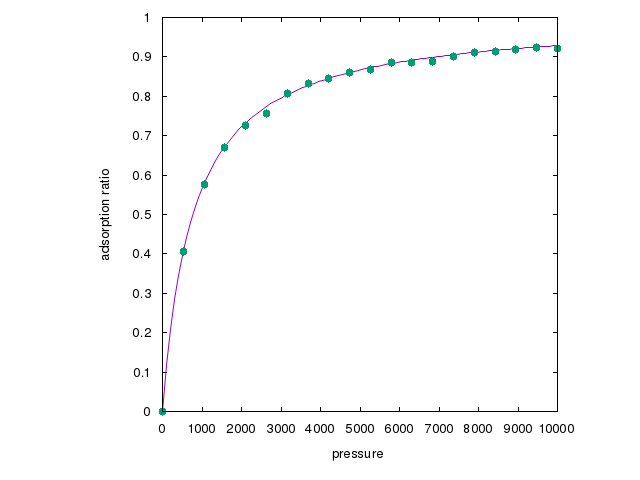

# Sample for Grand canonical sampling of Lattice gas models

## What is this sample?

This sample demonstrates the grand canonical sampling feature of `abICS`
by simulating two-dimensional lattice gas models that describe
adsorption of particles to two-dimensional surfaces.

The lattice gas model is defined on a discrete space in which each lattice cell
labeled by $i$ is occupied by a particle ($e_i=1$) or not ($e_i=0$).
The Hamiltonian is given by

```math
\mathcal{H} = J \sum_{\langle i j \rangle} e_i\,e_j + \left(E_\text{ads} - \mu\right)\sum_i e_i
```

where the first term denotes interaction between nearest neighbor sites $i$ and $j$ with coupling constant $J$.
The second term is the effect of adsorption with the adsorption energy $E_\text{ads}$.
$\mu$ is the chemical potential, which is related to the pressure $p$ by
$\mu = \mu_0 + k_B T \log p$ at the temperature $T$. $J=0$ is assumed in the following.

The adsorption isotherm is a relation between the pressure and the amount of adsorption
when particles in gas are adsorbed onto a solid surface under a certain temperature.
In the Langmuir adsorption model, it is assumed that adsorption occurs onto a homogeneous
surface with mono-layer coverage.
The Langmuir adsorption equation leads for the adsorption ratio $\theta$ as

```math
\theta = \dfrac{Kp}{1+Kp}
```

with an equilibrium constant $K$.

In this sample, the lattice gas model on two-dimesional $L_x \times L_y$ lattice with
a species $A$ is examined by the grand canonical Monte Carlo simulation
at a range of pressure values and at a fixed temperature, and the adsorption ratio at
each $p$ is evaluated.

## Prerequisites

Make sure that `abICS` is installed. No other library packages are required.

## How to run

A script `main.py` performs grand canonical sampling of the lattice gas model
for a specified range of pressure, and calculates expectation values of
adsorption ratio $\theta$.
To run the script, type in the command with a parameter file as follows:

```bash
python3 main.py input.toml
```

The parameter file `input.toml` contains simulation parameters in TOML format.
The list of parameters is summarized below:

- `[config]` section
  - `L`: lattice size represented by two-dimensional array.
  - `T`: temperature in unit of K.
  - `Eads`: adsorption energy in unit of eV.
  - `J`: coupling constant of nearest-neighbor interaction in unit of eV.
- `[sampling]` section
  - `thermalization_steps`: number of steps to be discarded for thermalization.
  - `sample_steps`: total number of samplings.
  - `sampling_frequency`: number of interval steps between measurement.
  - `print_frequency`: number of steps between print.
  - `p_start`, `p_end`, `p_steps`: initial and final values of pressure, and number of values to measure.
  - `p_scale`: how the intermediate pressure values are chosen. `linear` and `log` (logarithmic) are available.
  - `conf_start`: coverage of initial state. the value must be between 0 and 1, or a negative value for random choice.
  - `random_seed`: seed for random number generator.

When the script is executed, the values of pressure and the expectation values of energy and adsorption ratio are printed to console, as well as log messages.

The figure shows a plot of the adsorption ratio against the pressure.
The solid line represents a fit to Langmuir formula.


